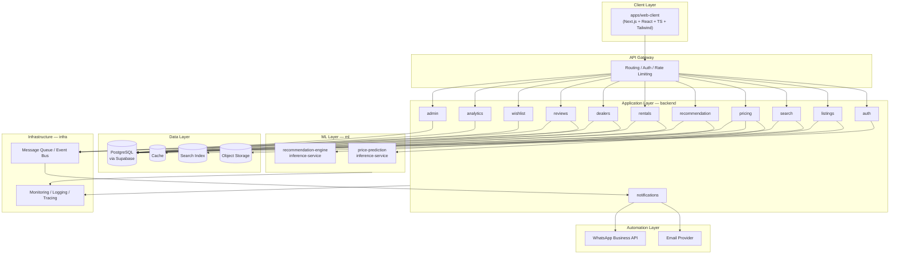
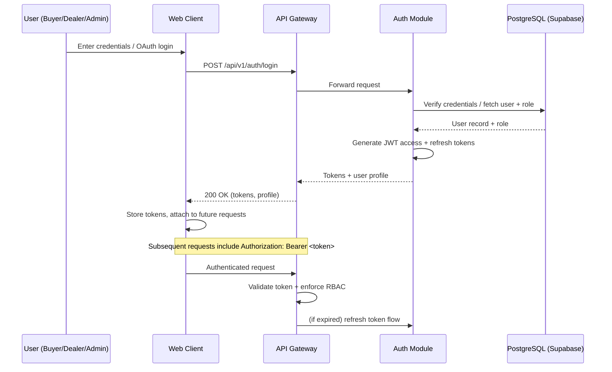
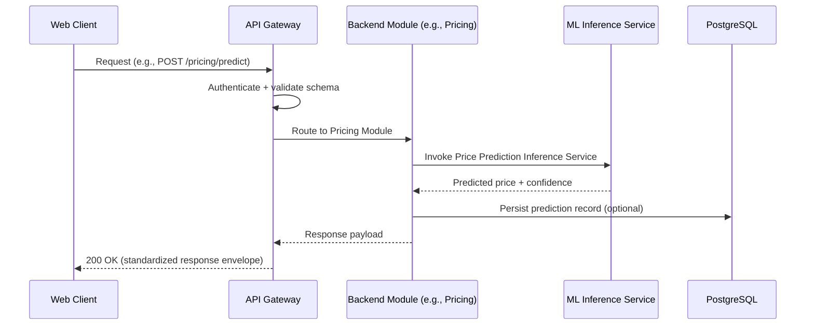
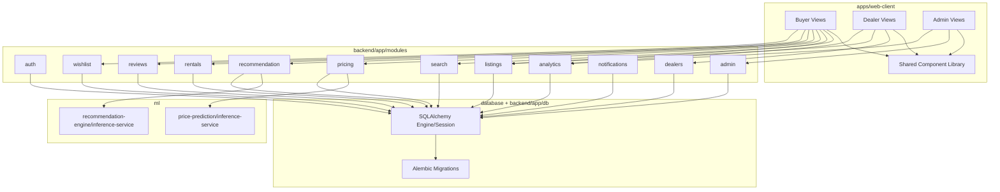
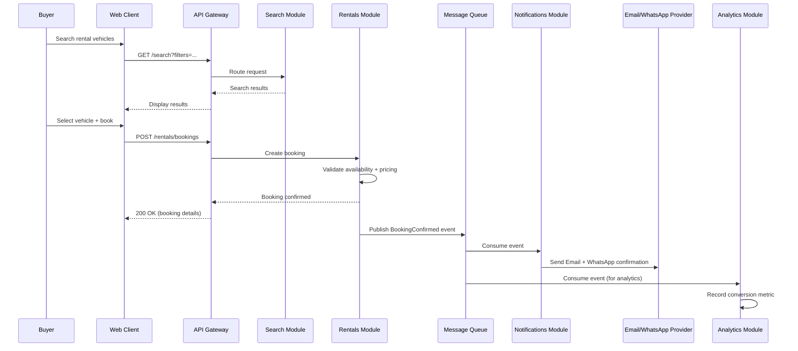

# AutoVerse AI — Architecture Documentation

**Document Owner:** Engineering / Principal Architecture
**Project:** AutoVerse AI — AI-Powered Automotive Intelligence Platform
**Status:** Active
**Location:** `docs/Architecture.md`

---

## Table of Contents

1. High-Level Architecture
2. Frontend Architecture
3. Backend Architecture
4. Machine Learning Architecture
5. Database Architecture
6. Authentication Flow
7. API Flow
8. Deployment Flow
9. Folder Structure
10. Component Diagram
11. Sequence Diagram
12. Scalability
13. Security

---

## 1. High-Level Architecture

AutoVerse AI is built as a **modular monolith** — a single deployable backend organized into strictly bounded domain modules — paired with a single Next.js frontend, decoupled ML inference services, and a PostgreSQL data layer via Supabase. This gives the team monolith-speed development today, with clean seams for extracting any module into an independent microservice later, without a structural rewrite.



### Architectural Principles
- **Domain-driven boundaries** — each backend module owns its data and exposes well-defined APIs; no cross-module direct database access.
- **Event-driven side effects** — bookings, lead creation, and review submission emit events consumed asynchronously by Notifications and Analytics.
- **API-first** — every module exposes a versioned REST API consumed identically by the frontend and internal callers.
- **Statelessness** — application services hold no in-memory session state, enabling horizontal scaling behind a load balancer.
- **ML/application decoupling** — ML inference services deploy and scale independently of the core backend release cycle.

---

## 2. Frontend Architecture

**Location:** `apps/web-client`
**Stack:** Next.js, React, TypeScript, Tailwind CSS

### Structural Principles
- **Feature-based organization** — each feature (`car-comparison`, `rentals`, `wishlist`, `dealer-dashboard`, etc.) is self-contained under `src/features/`, with its own components, hooks, and services.
- **Shared component library** — reusable, presentation-level components live in `src/components/`, consumed by all features to avoid duplication (per `docs/PROJECT_RULES.md`, Rule 6/7).
- **Role-based routing** — Buyer, Dealer, and Admin experiences are composed from shared layouts under `src/app/`, gated by role rather than duplicated as separate applications.
- **State management split:**
  - *Server state* (API data, caching, revalidation) via a dedicated data-fetching layer.
  - *Client/UI state* (modals, filters, local form state) via lightweight local state.
- **Design tokens** — colors, spacing, and typography defined centrally (Tailwind config) to guarantee visual consistency across Buyer/Dealer/Admin views.
- **Accessibility-first** — semantic HTML, ARIA labeling, and keyboard navigation built into shared components, not bolted on per-feature.

### Cross-Cutting Concerns
- Centralized API client with interceptors for auth token refresh and normalized error handling.
- Global error boundary with graceful fallback UI.
- Route-level code splitting to minimize initial bundle size.
- Analytics event instrumentation embedded at the component interaction level, feeding the Analytics module.

---

## 3. Backend Architecture

**Location:** `backend`
**Stack:** FastAPI, SQLAlchemy

### Layered Design (per module)

```
Controller (routes/) → Service (services/) → Repository (repository/) → Database
                              ↑
                         Schemas (schemas/) — request/response validation
                              ↑
                          Models (models/) — SQLAlchemy ORM models
```

Each domain module (`auth`, `listings`, `search`, `pricing`, `recommendation`, `rentals`, `dealers`, `reviews`, `wishlist`, `notifications`, `analytics`, `admin`) under `backend/app/modules/` follows this exact five-folder pattern, ensuring uniform structure and predictable navigation across the codebase.

### Design Patterns
- **Repository pattern** — abstracts persistence, enabling unit testing without a live database.
- **CQRS-lite** — read-heavy modules (Search, Analytics) maintain optimized, denormalized read models separate from transactional write models.
- **Event-driven integration** — cross-module workflows (e.g., booking confirmation → notification + analytics) are triggered via published events rather than direct synchronous calls, reducing coupling.
- **Circuit breaker & retry** — applied to calls toward ML inference services and third-party providers (Email/WhatsApp) to prevent cascading failures.

### Communication Patterns
- **Synchronous (REST)** for request-response operations (fetch listing, submit booking).
- **Asynchronous (message queue)** for side-effect-heavy workflows (notifications, analytics ingestion).

---

## 4. Machine Learning Architecture

**Location:** `ml`

### 4.1 Price Prediction (`ml/price-prediction`)
- **Training Pipeline** (`training-pipeline/`) — scheduled batch process ingesting historical listing/sales data, performing feature engineering (make/model/year, mileage, condition, location, seasonality, demand indices), and training ensemble regression models.
- **Inference Service** (`inference-service/`) — independently deployed FastAPI service exposing a versioned prediction endpoint, consumed by the `pricing` backend module.
- **Evaluation Gates** — automated accuracy/error threshold checks (MAE/RMSE) must pass before a new model version is promoted to production.

### 4.2 Recommendation Engine (`ml/recommendation-engine`)
- **Training Pipeline** — builds a hybrid model combining content-based filtering (vehicle attributes vs. stated preferences) and collaborative filtering (behavioral signals).
- **Inference Service** — independently deployed FastAPI service exposing a recommendation endpoint, consumed by the `recommendation` backend module.
- **Cold-Start Handling** — preference-questionnaire-driven recommendations and popularity fallback for new users/listings.

### 4.3 MLOps Practices
- Model versioning and experiment tracking for reproducibility.
- Shadow deployment / canary rollout for new model versions before full traffic cutover.
- Production monitoring for prediction drift, latency, and error rate.
- Strict separation between training pipeline (batch/offline) and inference service (real-time/online) lifecycles, deployment cadences, and scaling profiles.

---

## 5. Database Architecture

**Location:** `database` (migrations, seeds) + `backend/app/db` (engine/session/Base bootstrap)
**Engine:** PostgreSQL via Supabase

### Storage Strategy
- **Primary relational store (PostgreSQL)** — transactional data: users, dealers, listings, bookings, reviews, leads.
- **Search index** — denormalized projection of listings optimized for full-text/faceted queries, synchronized via events from the primary database.
- **Cache layer** — session data, hot listings, and ML prediction results.
- **Object storage** — vehicle images/media, referenced by URL from the relational database.
- **Analytics store** — aggregated event/reporting data, decoupled from transactional workloads.

### Design Principles
- Transactional entities normalized to 3NF for data integrity.
- Denormalized read models maintained separately for search/analytics without compromising transactional consistency.
- Soft deletes on user-facing entities (listings, reviews) to preserve audit history and support moderation.
- Indexing on high-cardinality filter fields (location, price range, make/model).
- Migrations (`database/migrations/`) and seed data (`database/seeds/`) are managed independently of application code, versioned via Alembic.

---

## 6. Authentication Flow



- JWT access tokens are short-lived; refresh tokens rotate on use.
- RBAC is enforced both at the API Gateway (coarse-grained route access) and within each module's service layer (fine-grained resource-action permissions).

---

## 7. API Flow



- All APIs are versioned (`/api/v1/...`), validated at the gateway and service layer, and return a standardized success/error response envelope.
- Idempotency keys are required on state-mutating endpoints prone to retries (bookings).

---

## 8. Deployment Flow

```mermaid
flowchart LR
    DEV["Developer Commit"] --> CI["CI Pipeline\n(.github/workflows)"]
    CI --> LINT["Lint + Type Check"]
    LINT --> TEST["Unit + Integration Tests"]
    TEST --> SCAN["Security / Dependency Scan"]
    SCAN --> BUILD["Build Containers\n(web-client, backend, ml services)"]
    BUILD --> STAGE["Deploy to Staging\n(infra/environments/staging)"]
    STAGE --> UAT["Staging Validation / UAT"]
    UAT --> APPROVE["Manual Approval Gate"]
    APPROVE --> PROD["Canary Deploy to Production\n(infra/environments/production)"]
    PROD --> FULL["Full Rollout"]
    FULL --> MON["Monitoring & Alerting"]
```



- Environments are isolated (`infra/environments/development`, `staging`, `production`) with environment-specific configuration via externalized secrets/config.
- Blue-green/canary deployment is used for high-risk releases (ML model updates, core service changes).
- Rollback is triggered automatically on failed health checks or breached error-rate thresholds during canary rollout.

---

## 9. Folder Structure

```
autoverse-ai/
├── apps/
│   └── web-client/            # Next.js frontend (Buyer/Dealer/Admin views)
├── backend/
│   └── app/
│       ├── api/v1/            # Versioned API router registration
│       ├── core/               # Configuration (env-driven)
│       ├── db/                 # Engine/session/Base bootstrap
│       └── modules/            # Domain modules (auth, listings, search,
│                                #   pricing, recommendation, rentals,
│                                #   dealers, reviews, wishlist,
│                                #   notifications, analytics, admin)
│           └── <module>/
│               ├── routes/
│               ├── schemas/
│               ├── models/
│               ├── services/
│               └── repository/
├── ml/
│   ├── price-prediction/
│   │   ├── training-pipeline/
│   │   └── inference-service/
│   └── recommendation-engine/
│       ├── training-pipeline/
│       └── inference-service/
├── database/
│   ├── migrations/
│   └── seeds/
├── infra/
│   ├── docker/
│   ├── environments/{development,staging,production}/
│   └── monitoring/
├── docs/
│   ├── PRD.md / SRS.md / Architecture.md / API.md / Database.md /
│   │   Deployment.md / Development_Roadmap.md / PROJECT_RULES.md /
│   │   UI_UX_Guidelines.md / CHANGELOG.md
├── tests/
│   ├── unit/ / integration/ / e2e/
├── docker-compose.yml
├── package.json
└── requirements.txt
```

This structure is fixed per `docs/PROJECT_RULES.md`. New capabilities are added *within* it — see "Where Every Future Module Should Be Placed" guidance previously established for this project.

---

## 10. Component Diagram



---

## 11. Sequence Diagram — End-to-End Buyer Booking Flow



---

## 12. Scalability

- **Stateless services** — all application modules are stateless, enabling horizontal auto-scaling behind a load balancer.
- **Database scaling** — read replicas for read-heavy workloads (search, analytics); connection pooling enforced across services.
- **Caching** — multi-layer caching (CDN for static assets, application-level cache for hot listings and ML prediction results) reduces database load.
- **Independent search index scaling** — decoupled from the transactional database, scaled based on query volume.
- **Asynchronous processing** — non-critical-path workloads (notifications, analytics ingestion, batch recommendation refresh) processed via message queue, decoupling load spikes from user-facing latency.
- **Independent ML scaling** — inference services scale on request volume/latency SLOs, separate from core application scaling.
- **Extraction-ready modules** — any backend module can be extracted into an independently deployed/scaled service as load demands increase, without a platform rewrite, due to strict module boundary enforcement.
- **Multi-region readiness** — architecture supports future multi-region deployment for latency reduction and disaster recovery.

---

## 13. Security

### Authentication & Authorization
- JWT-based access tokens (short-lived) with refresh token rotation.
- RBAC enforced at both API Gateway and service layer (defense in depth).
- OAuth 2.0 support for social login.

### Data Protection
- TLS enforced for all data in transit.
- Encryption at rest for sensitive data (PII, credentials, tokens).
- Secrets managed via a dedicated secrets manager — never hardcoded or committed to source control.

### Application Security
- Input validation/sanitization at all API boundaries.
- Rate limiting and throttling on public-facing endpoints (auth, search, prediction).
- CSRF/XSS protections on all client-facing forms.
- Automated dependency vulnerability scanning in CI/CD (`.github/workflows`).
- Regular penetration testing and OWASP Top 10 audits.

### Operational Security
- Principle of least privilege for service-to-service and human access.
- Full audit logging for privileged admin/dealer actions.
- Automated alerting on anomalous access patterns.
- Periodic access reviews and credential rotation.

### Compliance
- GDPR-aligned consent management and data subject request handling.
- Configurable data retention/deletion policies.
- Privacy-by-design applied to analytics and personalization (anonymization/pseudonymization where feasible).

---

*End of Document.*