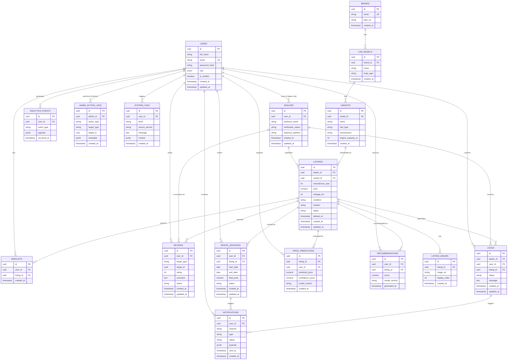

# AutoVerse AI — Database Design Documentation

**Document Owner:** Engineering / Data Architecture
**Project:** AutoVerse AI — AI-Powered Automotive Intelligence Platform
**Engine:** PostgreSQL (via Supabase)
**Status:** Active
**Location:** `docs/Database.md`

> Schema artifacts (migrations) live in `database/migrations/`; seed data in `database/seeds/`. SQLAlchemy ORM models for each table live in the owning backend module under `backend/app/modules/<module>/models/`, importing `Base` from `backend/app/db/base.py`, per `docs/Architecture.md` and `docs/PROJECT_RULES.md`.

---

## Table of Contents

1. Design Principles & Normalization
2. ER Diagram (Text)
3. Table Definitions
4. Relationships Summary
5. Indexing Strategy
6. Primary & Foreign Key Summary
7. Constraints & Data Integrity Rules
8. Denormalized / Read-Optimized Structures

---

## 1. Design Principles & Normalization

- **Normalization level:** All core transactional tables are normalized to **Third Normal Form (3NF)** — every non-key attribute depends on the whole primary key and nothing but the primary key. This eliminates update anomalies for entities like Users, Dealers, Listings, and Bookings.
- **Reference/lookup tables** (`brands`, `car_models`, `variants`) are split out specifically to avoid repeating group data (e.g., brand name, model name) inside every listing row — a direct 3NF requirement.
- **Denormalization is intentional and isolated:** the `search` module maintains a denormalized, read-optimized projection of listings (see Section 8) purely for query performance. This projection is never treated as the source of truth — the normalized relational tables are.
- **Soft deletes:** User-facing entities (`listings`, `reviews`) use a `deleted_at` timestamp rather than hard deletion, preserving audit history and supporting moderation workflows.
- **Ownership boundary:** Each table is owned by exactly one backend module (per `docs/Architecture.md`); no other module writes to it directly — all cross-module access goes through that module's service layer.
- **Surrogate keys:** All tables use a UUID surrogate primary key (`id`) rather than natural keys, to keep foreign keys stable and simplify distributed ID generation.
- **Auditability:** All tables include `created_at` / `updated_at`; privileged-action tables (`admin_action_logs`) are append-only.

---

## 2. ER Diagram (Text)

---

## 3. Table Definitions

### 3.1 `users`
Owning module: `auth`

| Column | Type | Constraints |
|---|---|---|
| `id` | UUID | PK, default `gen_random_uuid()` |
| `full_name` | VARCHAR(150) | NOT NULL |
| `email` | VARCHAR(255) | NOT NULL, UNIQUE |
| `password_hash` | VARCHAR(255) | NOT NULL |
| `role` | ENUM (`guest`, `buyer`, `dealer`, `support_agent`, `admin`, `super_admin`) | NOT NULL, default `buyer` |
| `is_verified` | BOOLEAN | NOT NULL, default `false` |
| `created_at` | TIMESTAMP | NOT NULL, default `now()` |
| `updated_at` | TIMESTAMP | NOT NULL, default `now()` |

### 3.2 `dealers`
Owning module: `dealers`

| Column | Type | Constraints |
|---|---|---|
| `id` | UUID | PK |
| `user_id` | UUID | FK → `users.id`, NOT NULL, UNIQUE |
| `business_name` | VARCHAR(200) | NOT NULL |
| `verification_status` | ENUM (`pending`, `verified`, `rejected`) | NOT NULL, default `pending` |
| `business_address` | TEXT | NULL |
| `created_at` | TIMESTAMP | NOT NULL, default `now()` |
| `updated_at` | TIMESTAMP | NOT NULL, default `now()` |

### 3.3 `brands`
Owning module: `listings`

| Column | Type | Constraints |
|---|---|---|
| `id` | UUID | PK |
| `name` | VARCHAR(100) | NOT NULL, UNIQUE |
| `logo_url` | VARCHAR(500) | NULL |
| `created_at` | TIMESTAMP | NOT NULL, default `now()` |

### 3.4 `car_models`
Owning module: `listings`

| Column | Type | Constraints |
|---|---|---|
| `id` | UUID | PK |
| `brand_id` | UUID | FK → `brands.id`, NOT NULL |
| `name` | VARCHAR(150) | NOT NULL |
| `body_type` | VARCHAR(50) | NULL (e.g., sedan, SUV, hatchback) |
| `created_at` | TIMESTAMP | NOT NULL, default `now()` |

Uniqueness: `(brand_id, name)` composite unique constraint to prevent duplicate model names under the same brand.

### 3.5 `variants`
Owning module: `listings`

| Column | Type | Constraints |
|---|---|---|
| `id` | UUID | PK |
| `model_id` | UUID | FK → `car_models.id`, NOT NULL |
| `name` | VARCHAR(150) | NOT NULL (e.g., "LXi", "ZXi+") |
| `fuel_type` | ENUM (`petrol`, `diesel`, `electric`, `hybrid`, `cng`) | NOT NULL |
| `transmission` | ENUM (`manual`, `automatic`, `cvt`, `amt`) | NOT NULL |
| `engine_capacity_cc` | INTEGER | NULL |
| `created_at` | TIMESTAMP | NOT NULL, default `now()` |

### 3.6 `listings` (Cars)
Owning module: `listings`

| Column | Type | Constraints |
|---|---|---|
| `id` | UUID | PK |
| `dealer_id` | UUID | FK → `dealers.id`, NOT NULL |
| `variant_id` | UUID | FK → `variants.id`, NOT NULL |
| `manufacture_year` | SMALLINT | NOT NULL |
| `price` | NUMERIC(12,2) | NOT NULL |
| `mileage_km` | INTEGER | NOT NULL, default 0 |
| `condition` | ENUM (`new`, `used`, `certified_pre_owned`) | NOT NULL |
| `location` | VARCHAR(150) | NOT NULL |
| `status` | ENUM (`draft`, `published`, `sold`, `rented`, `archived`) | NOT NULL, default `draft` |
| `deleted_at` | TIMESTAMP | NULL (soft delete) |
| `created_at` | TIMESTAMP | NOT NULL, default `now()` |
| `updated_at` | TIMESTAMP | NOT NULL, default `now()` |

### 3.7 `listing_images`
Owning module: `listings`

| Column | Type | Constraints |
|---|---|---|
| `id` | UUID | PK |
| `listing_id` | UUID | FK → `listings.id`, NOT NULL |
| `image_url` | VARCHAR(500) | NOT NULL |
| `display_order` | SMALLINT | NOT NULL, default 0 |
| `created_at` | TIMESTAMP | NOT NULL, default `now()` |

### 3.8 `reviews`
Owning module: `reviews`

| Column | Type | Constraints |
|---|---|---|
| `id` | UUID | PK |
| `user_id` | UUID | FK → `users.id`, NOT NULL |
| `target_type` | ENUM (`listing`, `dealer`) | NOT NULL |
| `target_id` | UUID | NOT NULL (polymorphic reference — validated at the application layer against `listings.id` or `dealers.id` per `target_type`) |
| `rating` | SMALLINT | NOT NULL, CHECK (`rating BETWEEN 1 AND 5`) |
| `comment` | TEXT | NULL |
| `status` | ENUM (`pending`, `approved`, `flagged`, `rejected`) | NOT NULL, default `pending` |
| `created_at` | TIMESTAMP | NOT NULL, default `now()` |
| `updated_at` | TIMESTAMP | NOT NULL, default `now()` |

### 3.9 `rental_bookings`
Owning module: `rentals`

| Column | Type | Constraints |
|---|---|---|
| `id` | UUID | PK |
| `user_id` | UUID | FK → `users.id`, NOT NULL |
| `listing_id` | UUID | FK → `listings.id`, NOT NULL |
| `start_date` | DATE | NOT NULL |
| `end_date` | DATE | NOT NULL, CHECK (`end_date >= start_date`) |
| `total_price` | NUMERIC(12,2) | NOT NULL |
| `status` | ENUM (`pending`, `confirmed`, `cancelled`, `completed`) | NOT NULL, default `pending` |
| `created_at` | TIMESTAMP | NOT NULL, default `now()` |
| `updated_at` | TIMESTAMP | NOT NULL, default `now()` |

### 3.10 `leads`
Owning module: `dealers`

| Column | Type | Constraints |
|---|---|---|
| `id` | UUID | PK |
| `dealer_id` | UUID | FK → `dealers.id`, NOT NULL |
| `user_id` | UUID | FK → `users.id`, NOT NULL |
| `listing_id` | UUID | FK → `listings.id`, NOT NULL |
| `status` | ENUM (`new`, `contacted`, `converted`, `closed`) | NOT NULL, default `new` |
| `message` | TEXT | NULL |
| `created_at` | TIMESTAMP | NOT NULL, default `now()` |
| `updated_at` | TIMESTAMP | NOT NULL, default `now()` |

### 3.11 `wishlists`
Owning module: `wishlist`

| Column | Type | Constraints |
|---|---|---|
| `id` | UUID | PK |
| `user_id` | UUID | FK → `users.id`, NOT NULL |
| `listing_id` | UUID | FK → `listings.id`, NOT NULL |
| `created_at` | TIMESTAMP | NOT NULL, default `now()` |

Uniqueness: `(user_id, listing_id)` composite unique constraint — a user can wishlist a given listing only once.

### 3.12 `price_predictions`
Owning module: `pricing`

| Column | Type | Constraints |
|---|---|---|
| `id` | UUID | PK |
| `listing_id` | UUID | FK → `listings.id`, NULL (nullable — predictions may be requested for a hypothetical vehicle not yet listed) |
| `user_id` | UUID | FK → `users.id`, NULL |
| `predicted_price` | NUMERIC(12,2) | NOT NULL |
| `confidence_score` | NUMERIC(5,4) | NOT NULL, CHECK (`confidence_score BETWEEN 0 AND 1`) |
| `model_version` | VARCHAR(50) | NOT NULL |
| `created_at` | TIMESTAMP | NOT NULL, default `now()` |

### 3.13 `recommendations`
Owning module: `recommendation`

| Column | Type | Constraints |
|---|---|---|
| `id` | UUID | PK |
| `user_id` | UUID | FK → `users.id`, NOT NULL |
| `listing_id` | UUID | FK → `listings.id`, NOT NULL |
| `score` | NUMERIC(5,4) | NOT NULL |
| `model_version` | VARCHAR(50) | NOT NULL |
| `generated_at` | TIMESTAMP | NOT NULL, default `now()` |

### 3.14 `notifications`
Owning module: `notifications`

| Column | Type | Constraints |
|---|---|---|
| `id` | UUID | PK |
| `user_id` | UUID | FK → `users.id`, NOT NULL |
| `channel` | ENUM (`email`, `whatsapp`) | NOT NULL |
| `type` | VARCHAR(100) | NOT NULL (e.g., `booking_confirmation`, `price_drop_alert`) |
| `status` | ENUM (`queued`, `sent`, `delivered`, `failed`) | NOT NULL, default `queued` |
| `payload` | JSONB | NOT NULL |
| `sent_at` | TIMESTAMP | NULL |
| `created_at` | TIMESTAMP | NOT NULL, default `now()` |

### 3.15 `admin_action_logs`
Owning module: `admin`

| Column | Type | Constraints |
|---|---|---|
| `id` | UUID | PK |
| `admin_id` | UUID | FK → `users.id`, NOT NULL |
| `action_type` | VARCHAR(100) | NOT NULL (e.g., `moderate_review`, `suspend_dealer`) |
| `target_type` | VARCHAR(50) | NOT NULL |
| `target_id` | UUID | NOT NULL |
| `metadata` | JSONB | NULL |
| `created_at` | TIMESTAMP | NOT NULL, default `now()` |

Append-only table — no `UPDATE`/`DELETE` permitted at the application layer, enforced via service-layer policy.

### 3.16 `system_logs`
Owning module: cross-cutting (written by all modules, queried via `admin`/observability tooling)

| Column | Type | Constraints |
|---|---|---|
| `id` | UUID | PK |
| `user_id` | UUID | FK → `users.id`, NULL |
| `level` | ENUM (`debug`, `info`, `warn`, `error`, `fatal`) | NOT NULL |
| `source_service` | VARCHAR(100) | NOT NULL |
| `message` | TEXT | NOT NULL |
| `context` | JSONB | NULL |
| `created_at` | TIMESTAMP | NOT NULL, default `now()` |

> Note: high-volume operational logs are primarily shipped to the centralized logging platform (per `docs/Architecture.md`, Section 13); `system_logs` retains only structured, queryable log records relevant to application-level auditing, not full infrastructure log volume.

### 3.17 `analytics_events`
Owning module: `analytics`

| Column | Type | Constraints |
|---|---|---|
| `id` | UUID | PK |
| `user_id` | UUID | FK → `users.id`, NULL (nullable for anonymous/guest events) |
| `event_type` | VARCHAR(100) | NOT NULL (e.g., `search_performed`, `listing_viewed`) |
| `payload` | JSONB | NOT NULL |
| `occurred_at` | TIMESTAMP | NOT NULL, default `now()` |

---

## 4. Relationships Summary

| Relationship | Type | Description |
|---|---|---|
| `users` → `dealers` | 1:1 | A user with the `dealer` role has exactly one dealer profile. |
| `dealers` → `listings` | 1:N | A dealer publishes many listings. |
| `brands` → `car_models` | 1:N | A brand has many models. |
| `car_models` → `variants` | 1:N | A model has many variants. |
| `variants` → `listings` | 1:N | A variant is instantiated by many individual listings (specific vehicle units). |
| `listings` → `listing_images` | 1:N | A listing has many images. |
| `users` → `reviews` | 1:N | A user writes many reviews. |
| `listings` / `dealers` → `reviews` | 1:N (polymorphic) | A listing or dealer receives many reviews via `target_type`/`target_id`. |
| `users` → `rental_bookings` | 1:N | A user makes many bookings. |
| `listings` → `rental_bookings` | 1:N | A listing can be booked multiple times across non-overlapping date ranges. |
| `dealers` → `leads` | 1:N | A dealer receives many leads. |
| `users` → `leads` | 1:N | A user submits many leads. |
| `listings` → `leads` | 1:N | A listing generates many leads. |
| `users` → `wishlists` | 1:N | A user wishlists many listings. |
| `listings` → `wishlists` | 1:N | A listing can be wishlisted by many users. |
| `listings` → `price_predictions` | 1:N | A listing can have multiple prediction records over time (as the model retrains). |
| `users` → `recommendations` | 1:N | A user receives many recommendation records. |
| `listings` → `recommendations` | 1:N | A listing can be recommended to many users. |
| `users` → `notifications` | 1:N | A user receives many notifications. |
| `users` (admin role) → `admin_action_logs` | 1:N | An admin performs many logged actions. |
| `users` → `analytics_events` | 1:N | A user (or guest session) generates many analytics events. |

---

## 5. Indexing Strategy

| Table | Index | Purpose |
|---|---|---|
| `users` | UNIQUE INDEX on `email` | Enforce uniqueness, fast login lookup |
| `users` | INDEX on `role` | Fast RBAC filtering |
| `dealers` | UNIQUE INDEX on `user_id` | Enforce 1:1 relationship |
| `brands` | UNIQUE INDEX on `name` | Prevent duplicate brands |
| `car_models` | UNIQUE INDEX on `(brand_id, name)` | Prevent duplicate models per brand |
| `car_models` | INDEX on `brand_id` | Fast lookup of models by brand |
| `variants` | INDEX on `model_id` | Fast lookup of variants by model |
| `listings` | INDEX on `dealer_id` | Dealer inventory queries |
| `listings` | INDEX on `variant_id` | Join to brand/model/variant hierarchy |
| `listings` | COMPOSITE INDEX on `(status, location, price)` | Core search/filter performance |
| `listings` | INDEX on `manufacture_year` | Year-based filtering |
| `listings` | PARTIAL INDEX on `deleted_at IS NULL` | Exclude soft-deleted rows from default queries |
| `listing_images` | INDEX on `listing_id` | Fast image retrieval per listing |
| `reviews` | INDEX on `(target_type, target_id)` | Polymorphic lookup of reviews per entity |
| `reviews` | INDEX on `status` | Moderation queue queries |
| `rental_bookings` | INDEX on `listing_id` | Availability checks |
| `rental_bookings` | INDEX on `user_id` | Booking history queries |
| `rental_bookings` | COMPOSITE INDEX on `(listing_id, start_date, end_date)` | Availability/overlap checks |
| `leads` | INDEX on `dealer_id` | Dealer lead dashboard |
| `leads` | INDEX on `status` | Lead pipeline filtering |
| `wishlists` | UNIQUE INDEX on `(user_id, listing_id)` | Prevent duplicate wishlist entries |
| `price_predictions` | INDEX on `listing_id` | Historical prediction trend lookup |
| `recommendations` | INDEX on `user_id` | Fast retrieval of a user's current recommendations |
| `notifications` | INDEX on `(user_id, status)` | Notification history and delivery status queries |
| `admin_action_logs` | INDEX on `admin_id` | Audit trail per admin |
| `admin_action_logs` | INDEX on `(target_type, target_id)` | Audit trail per affected entity |
| `system_logs` | INDEX on `(source_service, level, created_at)` | Operational log queries |
| `analytics_events` | INDEX on `(event_type, occurred_at)` | Time-windowed analytics aggregation |
| `analytics_events` | INDEX on `user_id` | Per-user behavioral analytics |

---

## 6. Primary & Foreign Key Summary

| Table | Primary Key | Foreign Keys |
|---|---|---|
| `users` | `id` | — |
| `dealers` | `id` | `user_id` → `users.id` |
| `brands` | `id` | — |
| `car_models` | `id` | `brand_id` → `brands.id` |
| `variants` | `id` | `model_id` → `car_models.id` |
| `listings` | `id` | `dealer_id` → `dealers.id`; `variant_id` → `variants.id` |
| `listing_images` | `id` | `listing_id` → `listings.id` |
| `reviews` | `id` | `user_id` → `users.id`; `target_id` → `listings.id` or `dealers.id` (polymorphic, application-validated) |
| `rental_bookings` | `id` | `user_id` → `users.id`; `listing_id` → `listings.id` |
| `leads` | `id` | `dealer_id` → `dealers.id`; `user_id` → `users.id`; `listing_id` → `listings.id` |
| `wishlists` | `id` | `user_id` → `users.id`; `listing_id` → `listings.id` |
| `price_predictions` | `id` | `listing_id` → `listings.id` (nullable); `user_id` → `users.id` (nullable) |
| `recommendations` | `id` | `user_id` → `users.id`; `listing_id` → `listings.id` |
| `notifications` | `id` | `user_id` → `users.id` |
| `admin_action_logs` | `id` | `admin_id` → `users.id` |
| `system_logs` | `id` | `user_id` → `users.id` (nullable) |
| `analytics_events` | `id` | `user_id` → `users.id` (nullable) |

**Referential integrity policy:**
- `ON DELETE RESTRICT` for foreign keys where the parent entity must not be removed while dependents exist (e.g., `dealers.user_id`, `listings.variant_id`).
- `ON DELETE CASCADE` reserved for strictly dependent child records with no independent meaning (e.g., `listing_images.listing_id`).
- All other user-facing parent entities (`users`, `listings`) use soft deletion (`deleted_at`) rather than hard deletes, so cascading deletes are avoided in favor of status-based exclusion.

---

## 7. Constraints & Data Integrity Rules

- `users.email` — UNIQUE, validated at both application and database level.
- `reviews.rating` — CHECK constraint, integer between 1 and 5 inclusive.
- `rental_bookings` — CHECK constraint ensuring `end_date >= start_date`; application-level overlap validation prevents double-booking of the same listing for overlapping date ranges.
- `wishlists` — composite UNIQUE (`user_id`, `listing_id`) prevents duplicate entries.
- `price_predictions.confidence_score` — CHECK constraint, numeric between 0 and 1 inclusive.
- `listings.status` transitions are enforced at the service layer (e.g., `draft → published → sold/rented/archived`), not just at the database level.
- `reviews.target_type` / `leads` / polymorphic references are validated at the application layer since PostgreSQL does not natively enforce polymorphic foreign keys — this is a deliberate, documented trade-off.
- All monetary columns (`price`, `total_price`, `predicted_price`) use `NUMERIC` (not floating point) to avoid rounding errors.
- All timestamps are stored in UTC; timezone conversion is handled at the presentation layer.

---

## 8. Denormalized / Read-Optimized Structures

To meet the search and analytics performance requirements defined in `docs/SRS.md` (NFR-1), the following read-optimized, denormalized structures are maintained **outside** the normalized transactional schema, synchronized via events emitted on write:

- **Search Index Projection** — a flattened, denormalized document per listing (combining `listings`, `variants`, `car_models`, `brands`, and aggregate review rating) maintained in a dedicated search index for fast full-text and faceted queries. This projection is rebuilt/synced asynchronously and is never the system of record.
- **Analytics Aggregates** — pre-aggregated rollups (e.g., daily active users, top models by region) computed from `analytics_events` and stored in an analytics data store, decoupled from the transactional database to avoid impacting OLTP performance.
- **Dealer Performance Summary** — a periodically refreshed materialized view/summary combining `listings`, `leads`, and `reviews` per dealer, powering the dealer analytics dashboard without requiring expensive joins on every request.

These structures are explicitly documented as **derived, eventually consistent views** — the normalized tables in Section 3 remain the single source of truth for all transactional operations.

---

*End of Document.*